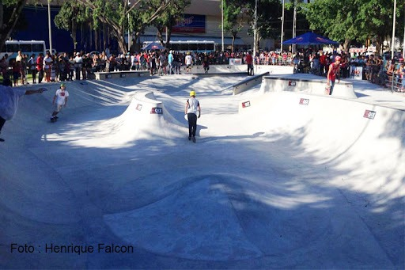

# A história do Parque solon de lucena

## Oque é?

O parque Sólon de Lucena, mais conhecido como *Lagoa*, é um dos pontos turísticos, e um dos cartões postais de João pessoa. 

## Características

 A “lagoa” está localizada no centro de Joao pessoa, sendo um dos pontos públicos mais famosos da cidade. O Parque é muito frequentado, tanto por turistas ou Habitantes da cidade, pois é um lugar onde se encontra 12 praças, ciclovia, pista de cooper, pista de skate com padrão internacional, área para esportes radicais, com slackline, parede de escalada e um deck disponível gratuitamente para festas e eventos. 

O parque é como um bosque, e por conta de seu paisagismo se tornou um dos mais bonitos cartões postais da cidade. Esse paisagismo foi feito pelo Paisagista Burle marx. 

## História

No inicio do século XX era conhecido como lagoa dos irerês e a lagoa era pertencente aos jesuítas. E foi em 1925 que o Governador Sólon de Lucena urbanizou o parque e se transformou em um lugar publico. Antes de 2016 o parque ele não passavam pessoas, pois em volta do parque haviam pistas que passavam ônibus e carros, e em 12 de junho de 2016 o prefeito Luciano Cartaxo inaugurou a lagoa reformada com novos quiosques, pistas de skate e etc.

algumas imagens antes da reforma

